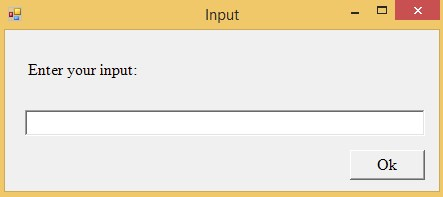

# scripts
Utility scripts made by myself over the years. They are provided under the MIT License

http://dendory.net/

### ad.bat
This script will add a batch of sample users to your AD structure based on a few criteria you provide.

### pushbullet.py
An unofficial pushbullet script to send Pushbullet notifications to all your devices.

Syntax:

    python3 pushbullet.py -key XXXXXXXXXXXXX -title "Test message" -message "This is a test"

### check_ssl.ps1
PowerShell script that retrieves information about a the SSL certificate.

Syntax:

    .\check_ssl.ps1 -URL https://example.com -Timeout 10

### r53nslookup
This is a PowerShell script that allows you to easily do a DNS lookup on any of your Route 53 Amazon records.

### Test-Uptime.psm1
Use Test-Uptime to compile a list of hosts and test connectivity. Run it on a schedule and view the last time your hosts were last up. The list of hosts is stored in a CSV file, and results are updated in that file each time the function is run. The default CSV is .\lastonline.csv

### Show-Chart.psm1
With Show-Chart you can create a chart on the screen and optionally save it to a file. It uses the Windows Forms control to create the chart, then can be controlled using various parameters. See the examples for details.

### aws_create_instance.ps1
This script will create an EC2 instance, a key pair to connect, add a Route 53 A record for it.

Example:

    .\aws_create_instance.ps1 -AMI ami-d2c924b2 -Subnet subnet-8e3bf3a2 -Type t2.nano -KeyName aws-test -Script c:\scripts\centos_init.sh -Hostname test.example.com -ZoneId Z1W5966G181726

### aws_destroy_instance.ps1
This script will terminate an EC2 instance, delete the attached volumes, remove the A record.

Example:

    .\aws_destroy_instance.ps1 -InstanceId i-XXXXXX -Hostname test.example.com -ZoneId Z1W5966G181726

### Show-Menu.psm1
Use this function to display a color menu on the console screen. It can display a number of menu items and await a choice, returning this choice. Optionally, it can also display some non-menu options. You can specify a title, a sub title, a prompt, menu options and non-menu options.

Example:

    Show-Menu -Title "This is a test of the menu system" -MenuOptions @("The first choice", "The good choice", "The last choice")

### Get-Excuse.psm1
This function returns an excuse to be used in a system administration or helpdesk role, based on the BOFH series. The excuses originate from the Bastard Operator From Hell excuse server at http://pages.cs.wisc.edu/~ballard/bofh/ and were modified to fit this module. Requires bofh.xml

### Get-FileMetadata.psm1
This function will return all metadata information about a specific file. It can be used to access the information stored in the filesystem.

### Get-GeoIP.psm1
Each IP block is assigned to a specific organization. This function queries the webservicex.net API to retrieve the last known country for a specific IP.

### Get-RandomPassword.psm1
This script creates a random password including upper case letters, lower case letters, numbers, and optionally complex characters.

Usage:

    Get-RandomPassword -Length 12 -Complex

### Read-InputBox.psm1
The Read-InputBox function creates a Windows Forms dialog box with custom text and awaits user input. The dialog box can be customized with various parameters. The text entered is then returned to the user:

### Resize-Image.psm1
This function uses the native .NET API to resize an image file, and optionally save it to a file or display it on the screen. You can specify a scale or a new resolution for the new image.

Example:

    Resize-Image -InputFile "C:\kitten.jpg" -Scale 30 -OutputFile "C:\kitten2.jpg"

### share_report.ps1
Produces an HTML report of available file shares.

### system_report.ps1
This should be run on the Task Scheduler every hour as a local administrator. Comment out any section you don't want. The only resource intensive one seems to be Windows Updates. The AntiVirus/AntiMalware sections only work on workstations, they will return empty strings on Windows Server. Look near the bottom of the script to configure alarm report emails / notifications.

### adhmailadd.ps1
This script creates an Active Directory user and an hMailServer user.

### pi-playlist.py
This script will play a number of mp3 files in random order

### wikipedia_define.py
Uses the wikipedia module to define words on the command line

### rssfeed.py
Converts a RSS feed into an HTML output

### event_monitor.ps1
Monitors the event log fromn the console

### logins.ps1
Shows a graphical list of user logins.

### inactive_users.ps1
Lists all AD users who haven't logged in 90 days

### indexed.ps1
Search the Windows file system for files modified within the last week using the Windows Search indexer

### backup_github.py
This script will download all master branches on Github for a specific user.

### check-website.ps1
This script will check a web page every 10 secs and show you a message box should it become unavailable or return an error message.
